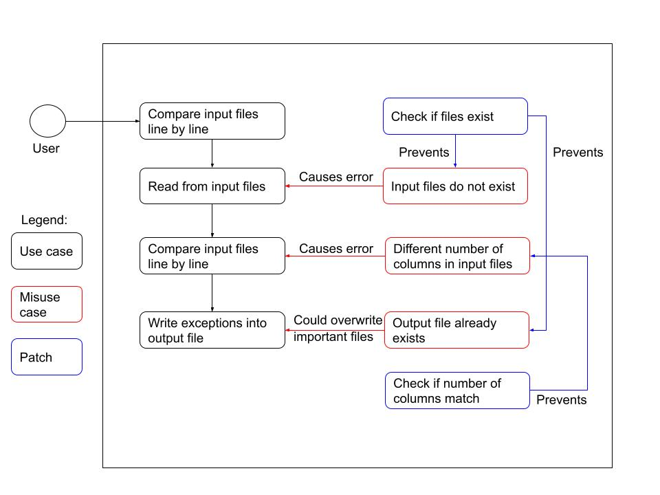

# 50003 Mini-Campaign
By: Jaron Ho (1005011)

## Purpose
This is a simple program to compare two CSV files line by line and check for exceptions. An exception means either of the following:

- A mismatch between 2 lines (e.g. if the program is set to check all lines that have <A,B>, and file1 has a line <A,B,C1> and file2 has a line <A,B,C2>, then both of those lines are exceptions)
- A line that exists in only 1 file but not the other (e.g. file1 has a line <A,B,C> while file2 has no lines that start with <A,B>, so <A,B,C> is an exception)

## Usage
1. Install the [Java Development Kit](https://www.oracle.com/java/technologies/downloads/).
2. In a terminal, run `javac CompareCSV.java` to compile the java file.
3. Then, run`java CompareCSV [input csv 1] [input csv 2] [output csv]`.

Replace `[input csv 1]`, `[input csv 2]`, `[output csv]` with your own file paths.
This will compare the two input CSV files and write the exceptions to the output CSV file.

Currently, the program can only compare the rightmost column of values. In future, this functionality will be expanded to any arbitrary column in the CSV.

## Use case diagram

